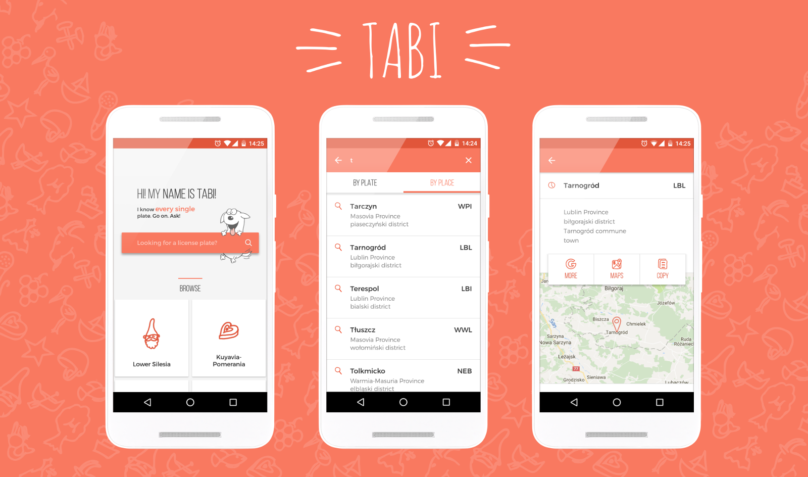

# Tabi

    

**Discover license plates of Poland**

Every license plate in Poland is connected to a country district. 
This car with „DOL” license plate, do you know where it’s from? Or this big city – Krakow – what license plates are used in there? 

Tabi is here for you to answer this questions.

## Main features

- Search through large database of Polish license plates
- Find every town or village in Poland
- Learn more about the place you found
- Discover new license plates every day

## Screens

    

## Architecture

**Tabi** is loosely based on ribot's [Android Boilerplate](https://github.com/ribot/android-boilerplate). You can read more about it's architecture [here](https://github.com/ribot/android-guidelines/blob/master/architecture_guidelines/android_architecture.md). 

## Libraries

* [Android Boilerplate](https://github.com/armcha/MVP-Architecture-Components) - for MVP architecture 
* [Dagger 2](https://github.com/google/dagger) - for dependency injection 
* [RxJava, RxAndroid](https://github.com/ReactiveX/RxJava) - for data manipulation 
* [SqlBrite](https://github.com/square/sqlbrite) - for handling database Rx way 
* [Butterknife](https://github.com/JakeWharton/butterknife) - for view binding 
* [Espresso](https://google.github.io/android-testing-support-library/) - for functional tests 
* [Mockito](http://mockito.org/) - For mocking in tests 
* [Pine](https://github.com/bskierys/Pine),[Timber](https://github.com/JakeWharton/timber) - for simple logging 
* [inApp Feedback](http://www.android-feedback.com/) - user feedback library 
* [EaseInterpolator](https://github.com/cimi-chen/EaseInterpolator) - advanced animation interpolators 
* [Overscroll decor](https://github.com/EverythingMe/overscroll-decor) - overscroll effect for android views 
* [About Libraries](https://github.com/mikepenz/AboutLibraries) - for listing all of those 
* [AutoValue](https://github.com/google/auto/tree/master/value)
* [Chrome Custom Tabs](https://developer.chrome.com/multidevice/android/customtabs)
* [Picasso](https://github.com/square/picasso)
* and more... (full list embeded in application)

## License

    Copyright 2016 Bartłomiej Kierys

    Licensed under the Apache License, Version 2.0 (the "License");
    you may not use this file except in compliance with the License.
    You may obtain a copy of the License at

       http://www.apache.org/licenses/LICENSE-2.0

    Unless required by applicable law or agreed to in writing, software
    distributed under the License is distributed on an "AS IS" BASIS,
    WITHOUT WARRANTIES OR CONDITIONS OF ANY KIND, either express or implied.
    See the License for the specific language governing permissions and
    limitations under the License.
